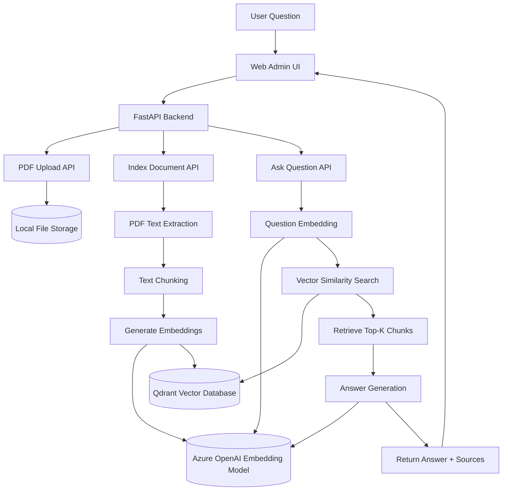
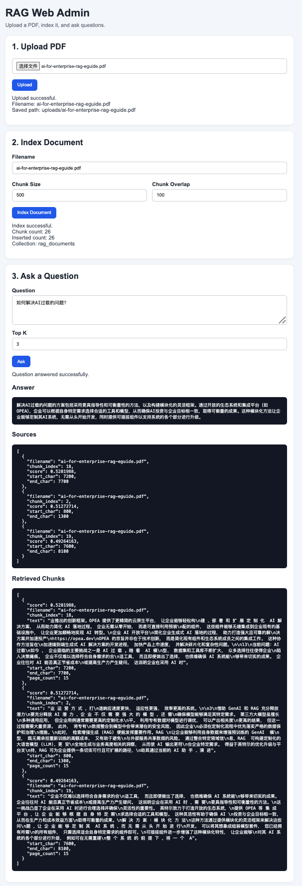

# AI PDF RAG Assistant


An AI-powered document question answering system built with **FastAPI, Azure OpenAI, and Qdrant**.

Upload a PDF → Index the document → Ask questions → Get answers grounded in the document content.

This project demonstrates a complete **Retrieval-Augmented Generation (RAG)** pipeline for building AI knowledge assistants.

---

# Project Overview

Large Language Models cannot reliably answer questions about private documents unless the relevant information is provided in the prompt.

This project implements a **Retrieval-Augmented Generation (RAG)** architecture that allows users to ask questions about PDF documents.

Pipeline:

```
PDF Upload
   ↓
Text Extraction
   ↓
Chunking
   ↓
Embedding (Azure OpenAI)
   ↓
Vector Storage (Qdrant)
   ↓
Semantic Search
   ↓
LLM Answer Generation
```

The system retrieves the most relevant document chunks and feeds them into the LLM to generate grounded answers.

---

# Architecture Diagram

The system follows a Retrieval-Augmented Generation (RAG) architecture.



This architecture enables the system to answer questions based on uploaded documents while keeping the responses grounded in the retrieved document context.

---
# Demo Screenshot

Example of the RAG system answering questions about a PDF document.



---

# Features

* Upload PDF documents
* Automatically extract and chunk text
* Generate embeddings using Azure OpenAI
* Store vectors in Qdrant
* Perform semantic search on document content
* Answer questions based on retrieved document context
* Display answer sources for transparency
* Lightweight web admin interface for testing

---
# Tech Stack

Backend

* FastAPI
* Python
* Azure OpenAI
* Qdrant
* PyMuPDF
* Pydantic

Frontend

* HTML
* CSS
* JavaScript

Infrastructure

* Docker (for Qdrant)

---

# Project Structure

```
backend/
│
├── app/
│   ├── main.py
│   ├── config.py
│   ├── llm_client.py
│   ├── document_loader.py
│   ├── chunker.py
│   ├── embedding.py
│   ├── vector_store.py
│   └── rag_pipeline.py
│
├── requirements.txt
└── .env.example

web-admin/
│
├── index.html
├── style.css
└── app.js
```

---

# How to Run the Project

## 1 Start Qdrant

```
docker run -p 6333:6333 qdrant/qdrant
```

---

## 2 Setup Backend

```
cd backend

python -m venv .venv
source .venv/bin/activate

pip install -r requirements.txt
```

Create a `.env` file:

```
AZURE_OPENAI_API_KEY=your_key
AZURE_OPENAI_ENDPOINT=https://your-endpoint.openai.azure.com
AZURE_OPENAI_DEPLOYMENT=your_chat_model
AZURE_OPENAI_EMBEDDING_DEPLOYMENT=your_embedding_model

QDRANT_URL=http://localhost:6333
QDRANT_COLLECTION_NAME=rag_documents
```

Run the backend:

```
uvicorn app.main:app --reload
```

---

## 3 Run Web Admin

```
cd web-admin
python3 -m http.server 5500
```

Open:

```
http://127.0.0.1:5500
```

---

# API Endpoints

### Upload PDF

```
POST /upload
```

---

### Index Document

```
POST /index/{filename}
```

This step:

* extracts text
* chunks the document
* generates embeddings
* stores vectors in Qdrant

---

### Ask Question

```
POST /ask
```

Example request:

```
{
  "question": "What is this document about?",
  "top_k": 3,
  "filename": "example.pdf"
}
```

---

# Web Admin Demo

The web admin interface allows you to:

1. Upload a PDF
2. Index the document
3. Ask questions about it

The interface displays:

* Generated answer
* Source chunks
* Retrieved document segments

---

# Design Decisions

### Chunking Strategy

Documents are split into overlapping chunks to preserve semantic continuity.

```
chunk_size = 500
chunk_overlap = 100
```

---

### Vector Similarity

The system uses **cosine similarity** for semantic search.

---

### Document Filtering

When multiple documents exist in the vector database, retrieval can be filtered by `filename` to avoid cross-document contamination.

---

# Future Improvements

Potential improvements:

* Multi-document knowledge base
* Streaming responses
* Hybrid search (vector + keyword)
* UI for document management
* Authentication
* Deployment with Docker Compose
* CI/CD pipeline

---

# License

MIT License
